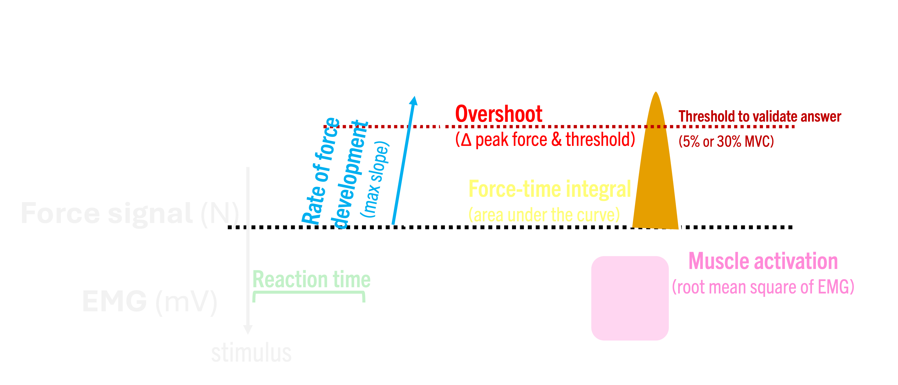

# CogMo

CogMo is a specialized tool for batch processing and visualizing force data exported from any data acquisition software. The CogMo Tool provides a dashboard for visual inspection of every trial in a novel scientific paradigm that manipulates both the motor and cognitive demands of a psychomotor experimental task.

Several key metrics are measured from force traces (e.g., peak force, rate of force development, response latency) and electromyography (EMG) traces (root mean square, pre-motor response latency). It is designed to save time during data processing after data acquisition. Although developed with data from the upper limbs (specifically, handgrip and wrist flexion/extension), the app can be used with any muscle group as long as the paradigm is correctly applied.

## Task description
The CogMo paradigm is designed to independently manipulate motor and cognitive workloads. In a typical setup, participants are seated at a computer screen and respond to visual stimuli (arrows) by contracting muscles.

1. **Manipulation of Motor Demand**

Motor demand is manipulated via the intensity of the contraction required for a response to be validated.

MVC Scaling: In the initial validation work (Bergevin et al., in progress), 5% and 30% of the Maximum Voluntary Contraction (MVC) were used to distinguish low from high motor demand.

Note: The app works specifically with percentages of the MVC; this strategy must be used for the automated metrics to calculate correctly.

2. **Manipulation of Cognitive Demand**

*Note: These are examples of cognitive manipulation. In practice, you could choose the manipulation of your choosing*

Cognitive demand is manipulated via the complexity of the instruction and stimulus location:

Low Demand: Arrows always appear in the center; participants identify the direction.

Moderate Demand: Arrows appear in the center. White arrows require a natural response (direction of arrow), while `#FFC0CB` pink arrows require an unnatural response (opposite direction).

High Demand: Arrows appear on the sides of the screen. Participants must process both the location and the colour (natural vs. unnatural response).

3. **Why use the CogMo tool?**

While typical experimental software (e.g., SuperLab, E-prime, PsychoPy) provides basic accuracy and reaction time, CogMo allows you to dive deeper into the force trace to extract further behavioral and neurophysiological data:

**Dissociated Timing**: Separate reaction time (initial force rise) from response time (crossing the validation threshold).

**Motor control**: Derive measures such as overshoot or undershoot relative to target thresholds.

**Neurophysiological Insights**: Upload EMG traces to calculate EMG RMS for each burst and pre-motor reaction time.

