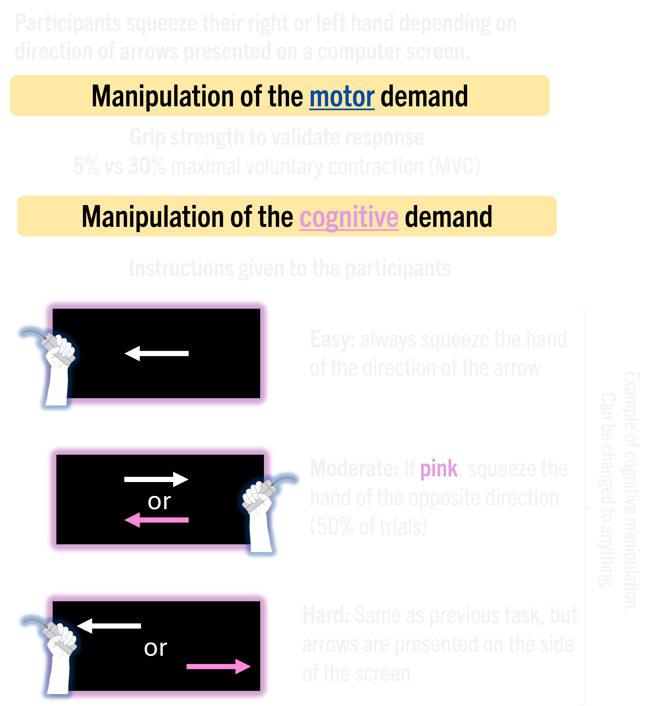
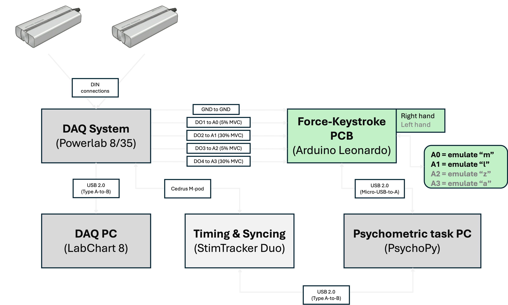
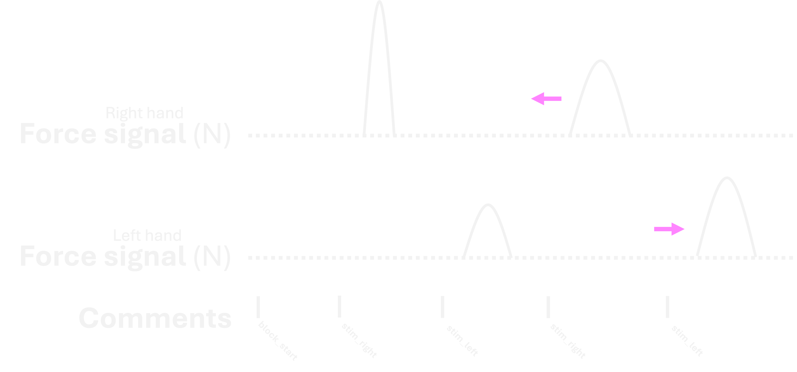
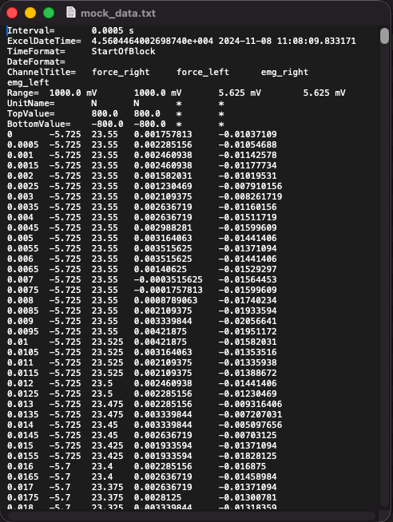

# CogMo

CogMo is a specialized tool for batch processing and visualizing force data exported from any data acquisition software. The CogMo Tool provides a dashboard for visual inspection of every trial in a novel scientific paradigm that manipulates both the motor and cognitive demands of a psychomotor experimental task.

Several key metrics are measured from force traces (e.g., peak force, rate of force development, response latency) and electromyography (EMG) traces (root mean square, pre-motor response latency). It is designed to save time during data processing after data acquisition. Although developed with data from the upper limbs (specifically, handgrip and wrist flexion/extension), the app can be used with any muscle group as long as the paradigm is correctly applied.

## Download
To get started, download the executable for your operating system. These packages include all necessary dependencies and do not require a Python installation.

| Platform | Download Link |
| :--- | :--- |
| **Windows** |  |
| **macOS** |  |

> [!IMPORTANT]
> **macOS Users:** After downloading, you must remove the "quarantine" flag before the app will run. After decompressing the .zip file, open your terminal and run:
> 
> `cd ~/Downloads && xattr -rd com.apple.quarantine CogMo_Toolkit-macos`

> [!NOTE]
> Because the app uses a portable version of Python, it may take a moment to launch. This is normal. It is the cost to avoid having the user install their own copy of Python on their machine. This also avoids potential compatibility issues.

## Task description
The CogMo paradigm is designed to independently manipulate motor and cognitive workloads. Below is an image example of the task. Note that while the motor demand **must** be manipulated via contraction intensity, cognitive demand can be manipulated in a number of ways. As such, the arrow task is an example. Similarly, the paradigm may be used with various muscle group and is not restricted to a prehension task.

### **Why use the CogMo toolkit?**
Obviously, this paradigm provides behavioural data that can be collected with any experimental software (e.g., SuperLab, E-Prime, PsychoPy). This app allows you to access more behavioural data by directly processing the force trace. For instance, a typical experimental software would only provide accuracy and reaction time. With the force traces, it is possible to dissociate reaction time (when the force begins to rise) from the response time (when the response is validated). It is also possible to derive other interesting measures, like whether participants over- or undershoot the threshold in specific conditions. In addition, you can choose to upload EMG traces alongside the force traces for additional processing and gain more insights into the neurophysiological systems during the paradigm. Currently, only EMG RMS for each contraction burst, as well as the pre-motor reaction time, are available. See figure below.

## Experimental setup
The app does not assume the use of specific hardware or software. However, the experimental setup must adhere to certain guidelines in order to use the CogMo Toolkit properly. Otherwise, the app may not be able to recognize your experimental design (e.g., how many blocks the experimental session contains) or be able to properly segment each trial. See below for details.

### Data acquisition

Data for the development phase were collected using a PowerLab 8/35 unit and LabChart 8 (ADInstruments, Colorado Springs, CO, USA). The task itself was run on PsychoPy version (x.x.x; Open Science Tools Ltd., Nottingham, United Kingdom). The handshake between the data acquisition software (i.e., LabChart 8) and the experimental software (i.e., PsychoPy) was done using a Arduino Leonardo (Arduino, Monza, Italy). Because PsychoPy is blind to the channels within LabChart 8 and thus to the force exerted on the grip force transducers, the Arduino emulated keystrokes. In other words, PsychoPy considered specific keys as either the correct or incorrect responses depending on the stimulus presented on the computer screen.

In practice, any keystrokes may be used. The following keys were used and are demonstrated as an example. It should also be borne in mind that PsychoPy specifically ignored keys corresponding to 5% MVC responses during the 30% MVC blocks to avoid "undershoot" being treated as valid responses.

| Hand (Correct Response) | Target Force | Emulated Key |
| :--- | :--- | :--- |
| **Right Hand** | 5% MVC | `m` |
| **Right Hand** | 30% MVC | `l` |
| **Left Hand** | 5% MVC | `z` |
| **Left Hand** | 30% MVC | `a` |

> [!NOTE]
> The **Hand** column refers to the correct physical response required by the participant, which triggers the specific keystroke emulated by the Arduino. During 30% MVC blocks, 5% MVC keys were ignored to prevent premature responses.

Once the experimental software is responsive to the participants' responses, the experimenter should make sure that the behavioural (and potentially the physiological data) is synchronized with the task. To do so, the minimum requirements is to have a comment appear in the data acquisition software at the start of each block (below -- 'block_start') and at each stimulus presentation (below -- 'stim_[correct response]'). **Note that it is imperative that the correct response is embedded in the comment, as the app extracts this information on a trial-by-trial basis from it.**

The app requires two files to function with the acquired data. The first file is the raw data from the data acquisition software. It is highly recommended to extract only the channels used—both the right and left force channels, and the EMG channels if desired. The time channel should be automatically exported by default. This should help reduce file size. Also, be sure that the software exports the comments along with it. Some software embeds the comments in the last column; others may embed them in the column of whichever channel they were assigned to. The app should automatically handle such cases, but be sure to test your setup in case you run into compatibility issues. It does not matter whether the metadata is exported; the app discards it because it is not used internally.

Below the header of a mock data file (.txt). It contains 4 data columns (2 with force traces and 2 with EMG traces), the first column being time. As mentioned above, the metadata will be discarded when uploaded to the app. Comments are not shown, but they appear on the rows where stimuli were presented and at the start of blocks.

The second required file is the blocks in which the participants performed them. It is highly recommended that the experimental software saves this order in its output. For the app to work, the order should be uploaded in long format (.csv or .xlsx), with one row per block. If your design contains 24 blocks, the file should then contain 24 rows, excluding the header. Below is an example with only 6 rows.

| participant | cognitive | motor |
| :--- | :--- | :--- |
| 001 | moderate | low force |
| 001 | moderate | high force |
| 001 | moderate | low force |
| 001 | hard | high force |
| 001 | easy | low force |
| 001 | hard | low force |

